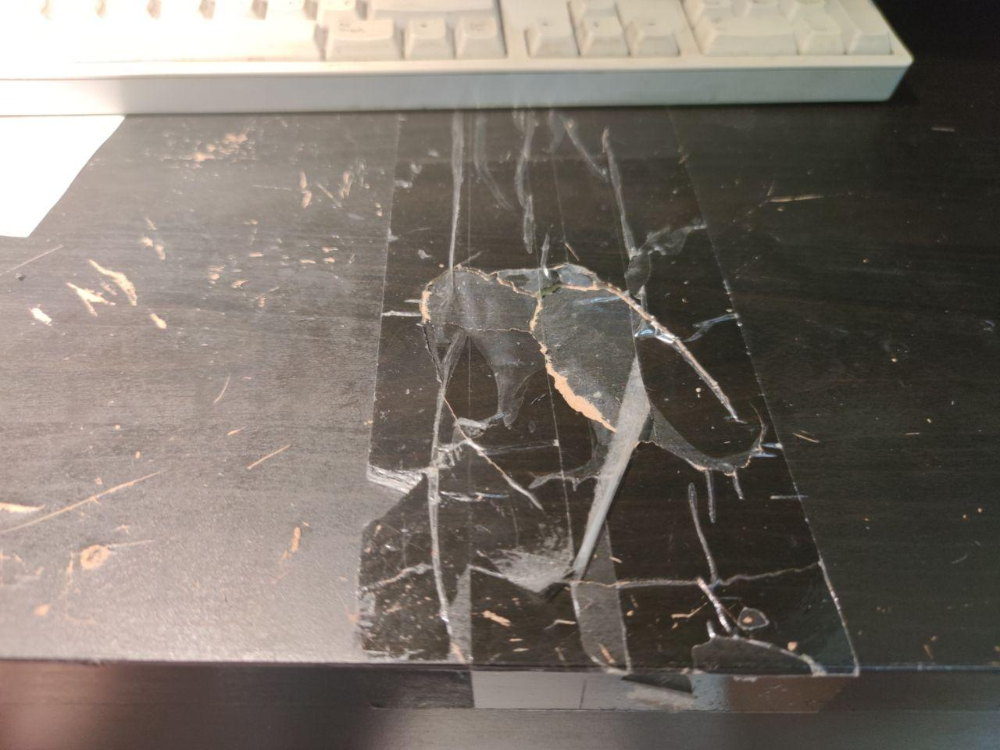
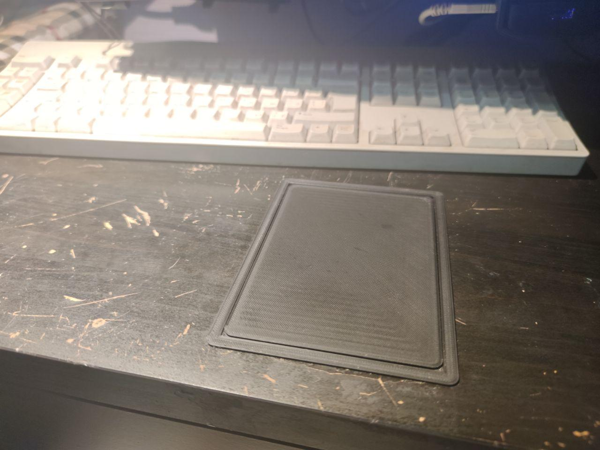
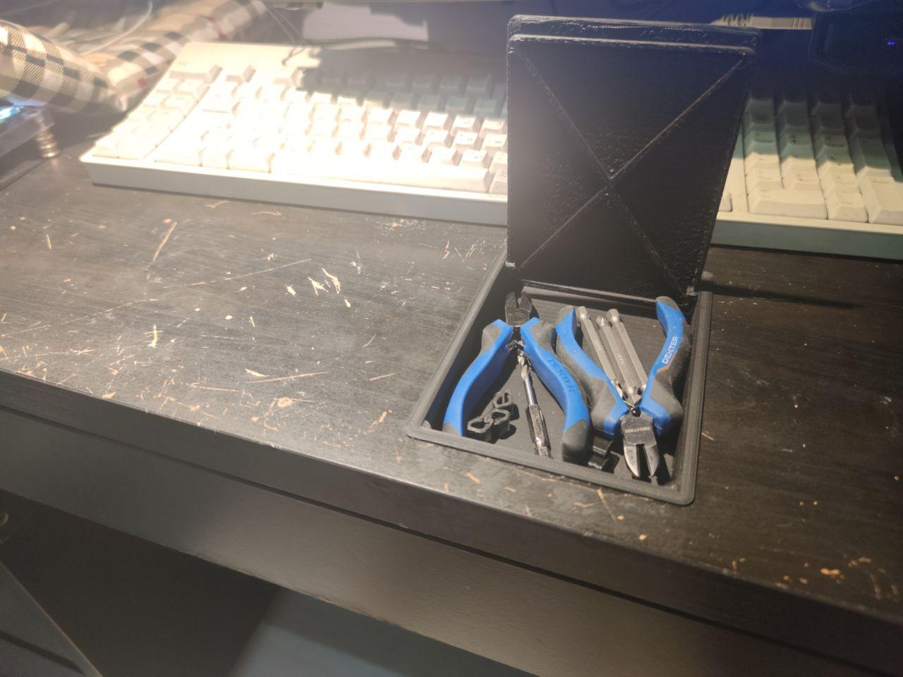
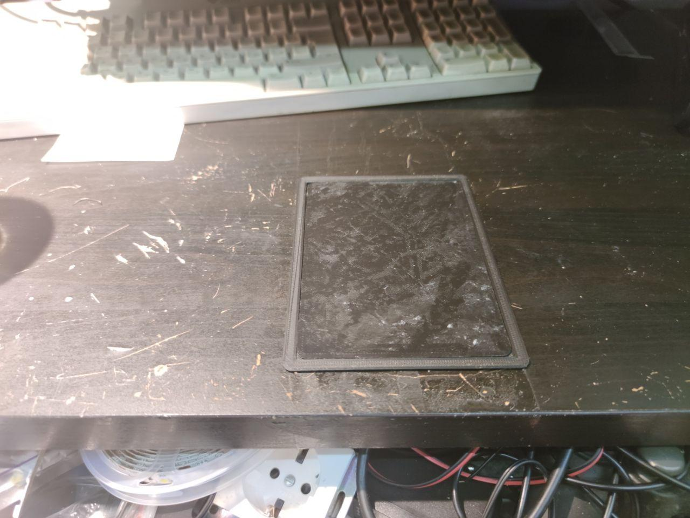
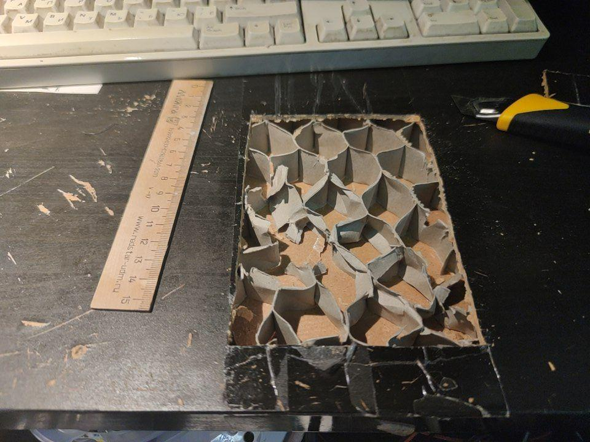
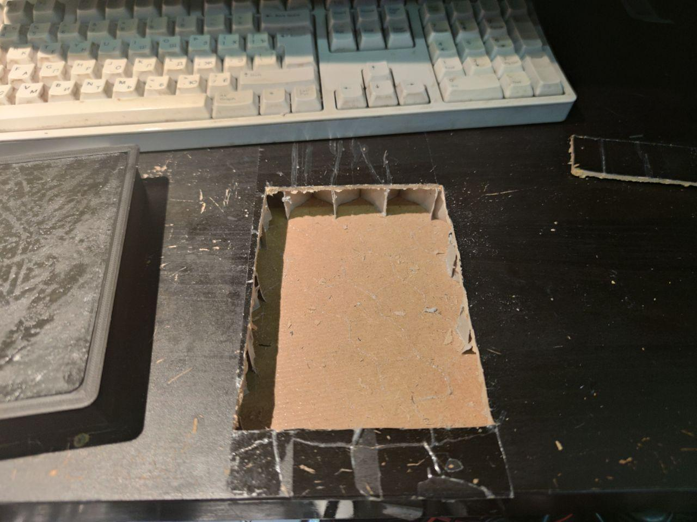
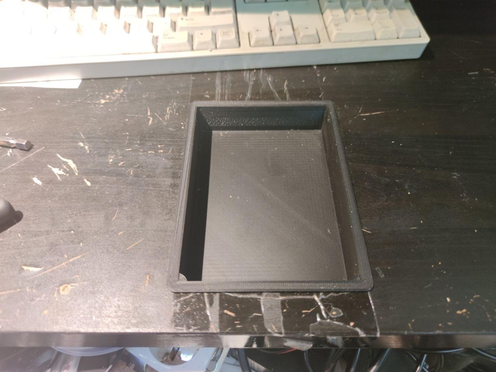
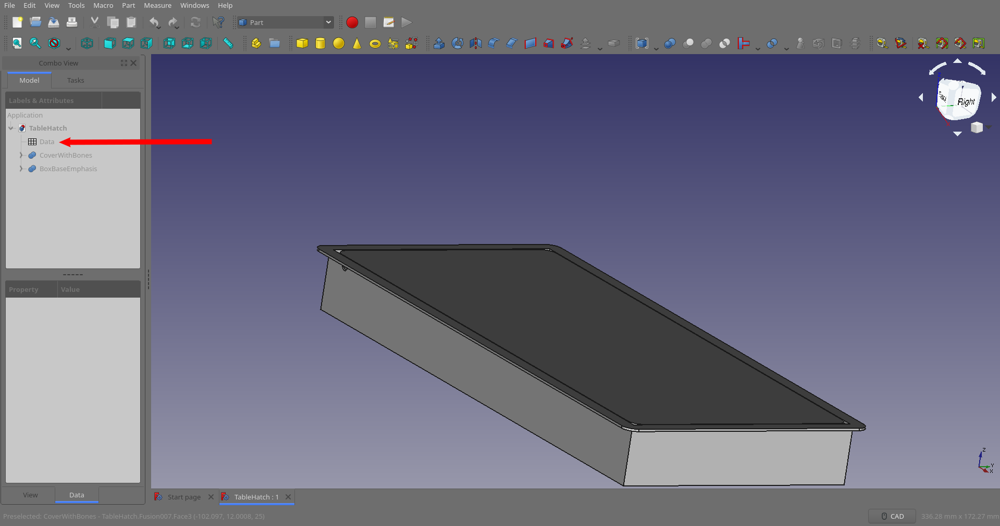
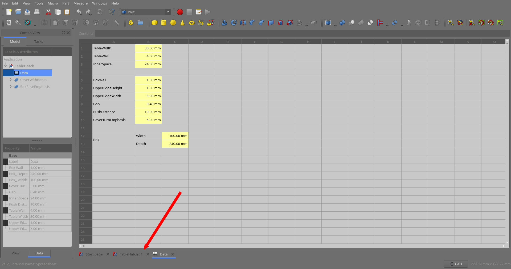
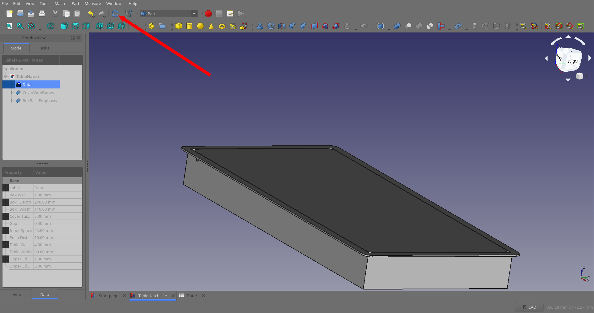

# Table Hatch

## About

Some IKEA furniture has thick enough tabletop to place there something useful.
Additionally all thick panels made from paper and they are hollow, so they are
easy to break or cut the holes in them with just knife.

So here what I have first.

And what I done with it, using knife, 3D printer and open source
[FreeCAD][1].

 

## What do you need to reimplement

As I said, you (or maybe your friend) need the 3D printer, knife and thick
enough (30 millimeters in my case) tabletop made from paper like IKEA-ones.

Additionally you may need for [FreeCAD][1] installed on your PC. It is
absolutely free, you can install it from your Linux Distribution repositories or
from site. Or you can use prepared by myself models which I used for myself if
they suit you.

I will start with printing hints in case you choose to use ready-to use models.
Then I will show you how to mount the printed hatch, then - how to modify models
for ones who familiar with FreeCAD and at last - for ones who do not.

## Printing

The model has two parts: the box and cover.

You can print the box any way you wish but if you prints it with borders to top
you should to handle the borders from their bottom to make them fit snugly to
the surface.

If you have a dirty or rough printing table - you better to print the cover with
face up to achieve the result like this:

but not this:

## Installing

This is simple. Cut the hole and place there your new hatch. Be aware of
wooden bones inside the tabletop.

## Modifying (Simple)

There is the table 'Data' in FreeCAD project with all basic parameters (do not
forget to add 'mm' or other units to values):

* Box - this is the main values you need to modify. The describe the __inner__
  useful square of your hatch
  * Width - width (by Y)
  * Depth - length (by X)

* TableWidth - the thickness of overall your tabletop.
* TableWall - the thickness of plywood the table made from.
* InnerSpace - the height you can count on. Calculated from two above minus
    2 mm.
* BoxWall - the thickness of models's walls.
* UpperEdgeHeight - the thickness of the box side
* UpperEdgeWidth - the width of the box side
* Gap - the extra gap between the box and cover.
* PushDistance - the hatch opens like the lever arm. This value is the shortest 
    arm where you push.
* CoverTurnEmphasis - how far the rotor will supports the cover.

## Modifying (In detail)

1. Open TableHatch.FCStd file with freecad
2. Double-click on __Data__ table 
3. Click on the value you want to edit and modify it like in Excel. Do not
   forget to add units ('mm') to your values. See previous chapter to find the
   values description.
4. Go back to the model view 
5. Rebuild the model if needed and check is it looks okay.
   
6. Export models: select one of the fusion (CoverWithBones) with left-click and
   File - Export, save the stl model (cover.stl). The same for another
   (BoxBaseEmphasis -> box.stl).

[1]: https://github.com/FreeCAD/FreeCAD
